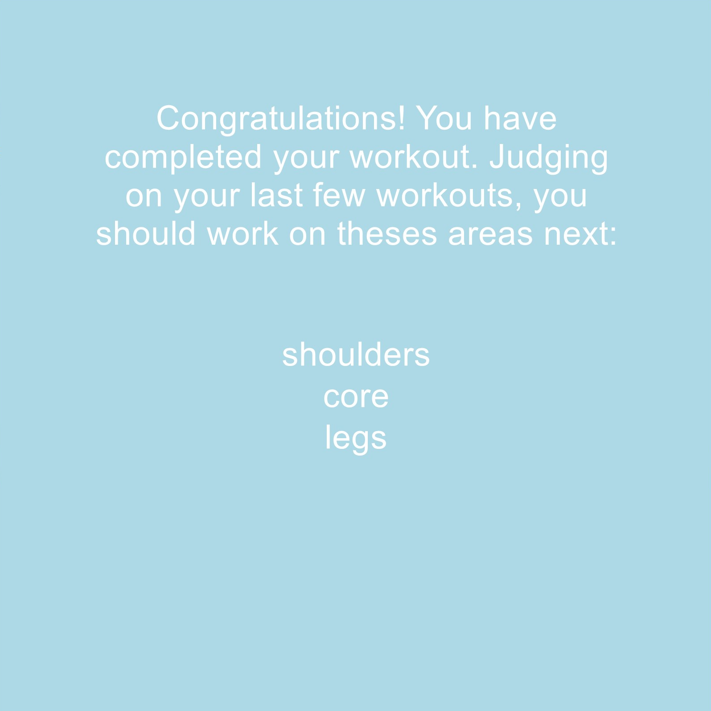

# Coronasthenics
Author: Owen Michuda
---
### Create custom workouts based on target areas you input!

## Dependencies
* [MSVC 2015](https://visualstudio.microsoft.com/)
* [CMake](https://cmake.org/)
* [Cinder](https://libcinder.org/)
* [SQLite](https://www.sqlite.org/index.html)
* [sql-modern-cpp](https://github.com/SqliteModernCpp/sqlite_modern_cpp)
* [gflags](https://github.com/gflags/gflags)

## How to Run
* Enter desired attributes into gflags
* Run the program
* | Key       | Action                                                      |
  |---------- |-------------------------------------------------------------|
  | `space`   | Pauses and resumes the workout                              |
